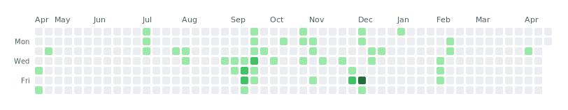

# GitHub Chartify

Animate a GitHub contributions graph into weekly and daily bar charts as SVG.

This action reads your public GitHub contribution graph and renders it as an animated SVG bar chart, grouped by week or day.

<picture>
  <source media="(prefers-color-scheme: dark)" srcset="data/chartify-dark.svg" />
  <source media="(prefers-color-scheme: light)" srcset="data/chartify.svg" />
  
</picture>

## Usage

Add a workflow file (e.g. `.github/workflows/update-chart.yml`):

```yaml
name: Update GitHub Contributions Chart

on:
  schedule:
    - cron: '0 0 * * *'
  workflow_dispatch:

jobs:
  update-chart:
    runs-on: ubuntu-latest
    permissions:
      contents: write

    steps:
      - name: Checkout repository
        uses: actions/checkout@v4

      - name: Generate contribution chart
        uses: iranovianti/github-chartify@v1
        with:
          output_path: 'data/contributions.svg'
          speed: 'fast'             # fast, medium, or slow
          mode: 'both'              # both, vertical, or horizontal
          loop: 'true'              # true or false
          transform_style: 'rectangle' # rectangle or circles

      - name: Commit and push
        run: |
          git config --local user.email "github-actions[bot]@users.noreply.github.com"
          git config --local user.name "github-actions[bot]"
          git add data/
          git diff --staged --quiet || git commit -m "Update contribution chart"
          git pull --rebase
          git push
```

Then embed the SVG in your profile README:

```html
<picture>
  <source media="(prefers-color-scheme: dark)" srcset="data/contributions-dark.svg" />
  <source media="(prefers-color-scheme: light)" srcset="data/contributions.svg" />
  
</picture>
```

Example on my profile: [github.com/iranovianti](https://github.com/iranovianti).

## Inputs

| Input | Default | Description |
|-------|---------|-------------|
| `github_username` | Repository owner | GitHub username |
| `output_path` | `data/contributions.svg` | SVG output path |
| `speed` | `fast` | `fast`, `medium`, or `slow` |
| `mode` | `both` | `both`, `vertical`, or `horizontal` |
| `loop` | `true` | Loop animation |
| `transform_style` | `rectangle` | `rectangle` or `circles` |

## Styles

### Rectangle (default)

<picture>
  <source media="(prefers-color-scheme: dark)" srcset="data/chartify-dark.svg" />
  <source media="(prefers-color-scheme: light)" srcset="data/chartify.svg" />
  
</picture>

### Circles

<picture>
  <source media="(prefers-color-scheme: dark)" srcset="data/chartify-circles-dark.svg" />
  <source media="(prefers-color-scheme: light)" srcset="data/chartify-circles.svg" />
  
</picture>

### Vertical only

<picture>
  <source media="(prefers-color-scheme: dark)" srcset="data/chartify-vertical-dark.svg" />
  <source media="(prefers-color-scheme: light)" srcset="data/chartify-vertical.svg" />
  
</picture>

### Horizontal only

<picture>
  <source media="(prefers-color-scheme: dark)" srcset="data/chartify-horizontal-dark.svg" />
  <source media="(prefers-color-scheme: light)" srcset="data/chartify-horizontal.svg" />
  
</picture>
